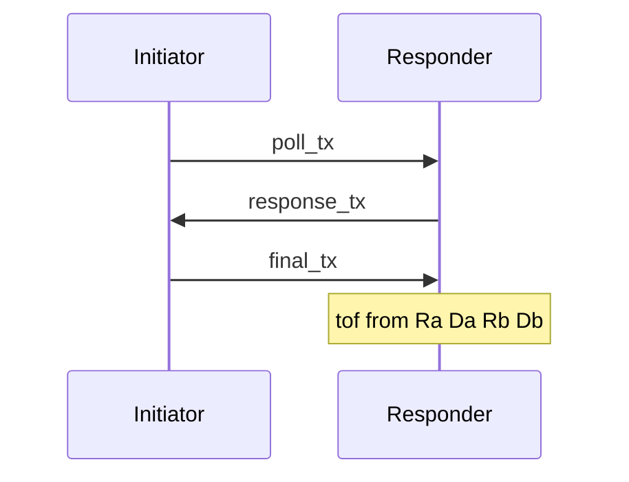

# Manual distance measurement

You edit `Vendor examples/RC2_0_DWM1004C_V3_1_Package/Software/DWM1004C-TDoA-Tag/Src/instance/instance.c` and the files around it. Review each step after you edit it. Flash free at the start of this work was about 6.5 KB (`text` 26144 + `data` 108). Keep new code small: no extra `sprintf` paths, do not call the commented LIS3DH functions or `--gc-sections` will link them back.

Same binary shape on both modules. One `#define` selects initiator or responder. Radio settings stay the ones already in `Src/config/default_config.h`: channel 2, 64 MHz PRF, 128-symbol preamble, 6.8 Mbps. Both modules must match.

Status: steps 1, 2, 3, and 4 reviewed and accepted. The role macros in the code are `TWR_INT` and `TWR_RSP`.



## Step 1 — stop the blink tag

In `Src/main.c` the call was `instance_init(1)`. Change that argument to `0`.

`sleep_enable == 1` adds `DWT_SLP_EN` inside `instance_init()`, which allows the DW1000 to sleep. `0` configures the same wake registers without `DWT_SLP_EN`. Ranging needs the chip awake, so pass `0`.

That flag does not cover `dwt_entersleepaftertx`. In `instance_init()` that call was `dwt_entersleepaftertx(1)` on both branches. Change it to `0` as well, or the chip sleeps after every transmit even when `sleep_enable` is `0`.

Leave `main.c` calling `instance_run()` while `app.blinkenable` is 1. The accelerometer block you already commented stays commented.

`TA_INIT` was calling `dwt_configuresleep(..., DWT_SLP_EN)` and overwriting the `instance_init(0)` setup. Removing that call is safe. `dwt_entersleepaftertx(0)` is what stops sleep after transmit, and nothing else calls `dwt_entersleep()`. The `dwt_configuresleep()` inside `instance_init()` can stay: with `sleep_enable == 0` it does not set `DWT_SLP_EN`.

The STM32 sleep stays for now. The live pause is `low_power(delay)` next to `LEDS_INVERT` in `instance_run()` when `done == 2`. With the default 100 ms blink, `delay` is about 76–95 ms, so that branch is the one that runs. The two commented `low_power()` calls in the `else` do not run at this blink rate. Leave this pause until the blink state machine is replaced. The later poll interval must not call `low_power()`.

## Step 2 — frames

Add the ranging frames in `Src/instance/pckt_ieee.h`. Leave `iso_IEEE_EUI64_blink_msg` as it is. That blink is a different frame: one control byte `0xC5` and an 8-byte tag ID. Ranging uses a normal 802.15.4 data frame. Frame control is two bytes, `0x41` then `0x88`: data frame, 16-bit destination, 16-bit source, one PAN id shared by both addresses.

Common header, same on poll, response, and final. Multi-byte fields are little-endian, matching the DW1000 timestamp bytes.

- byte 0: `0x41`
- byte 1: `0x88`
- byte 2: sequence number, incremented by the sender on each transmit
- bytes 3–4: PAN id, both modules use the same value, for example `0xCA, 0xDE`
- bytes 5–6: 16-bit destination
- bytes 7–8: 16-bit source
- byte 9: function code

Use fixed short addresses. Initiator `0x0001` is the bytes `{0x01, 0x00}`. Responder `0x0002` is the bytes `{0x02, 0x00}`. Poll and final travel initiator to responder, so destination is the responder and source is the initiator. The response swaps those two address fields.

Function codes: poll `0xE0`, response `0xE1`, final `0xE2`.

Poll and response end at byte 9. Declare a 2-byte `fcs` array after the function code, the same way the blink struct does. The DW1000 overwrites those two bytes. Length passed to `dwt_writetxdata` / `dwt_writetxfctrl` is `sizeof(Ranging_Frame)`, which is 12 and already includes the CRC.

The final frame adds three timestamps after byte 9, 5 bytes each, little-endian, in this order: poll TX, response RX, final TX. Then the 2-byte `fcs`. Length is `sizeof(Ranging_Frame_Final)`, which is 27. The responder checks the function code and both addresses before it uses those 15 bytes. A poll or response with the wrong code is ignored.

`ctrl1`, `ctrl2`, and `PAN_id` are `const`, so they are set in an initializer. `seq_num`, `dst`, `src`, and `fc` can be written later. Every ranging field is `uint8_t`, so the compiler does not insert padding.

## Step 3 — timestamps and role

This step adds storage and state names. It does not send a poll or compute a distance. After it builds, the module no longer blinks.

In `Src/instance/instance.h`, or at the top of `instance.c`:

- `#define TWR_INIT 0` and `#define TWR_RESP 1`
- `#define TWR_ROLE TWR_INIT` on the initiator build. The responder build uses `TWR_RESP`. One value per image.
- `#define TS_MASK 0xFFFFFFFFFFULL`. Every subtraction of two DW1000 times is masked with this. The timestamp is 40 bits. A plain 64-bit subtract wraps wrong when the clock crosses `2^40`.

Add these fields to `instance_data_t`:

- `uint64_t poll_tx_ts, poll_rx_ts, resp_tx_ts, resp_rx_ts, final_tx_ts, final_rx_ts`
- `Ranging_Frame poll_msg`
- `Ranging_Frame resp_msg`
- `Ranging_Frame_Final final_msg`
- `uint8_t rx_buffer[27]`

`uint64_t` needs `stdint.h` if the build does not already see it. Set the six timestamps to 0 in `instance_init()`. `ctrl1`, `ctrl2`, and `PAN_id` are `const`, so `poll_msg`, `resp_msg`, and `final_msg` must be initialized with `{0x41, 0x88, 0, {PAN bytes}, ...}`, not assigned later.

Address bytes: initiator `{0x01, 0x00}`, responder `{0x02, 0x00}`. Poll and final use destination = responder and source = initiator. The response swaps them. Both images use the same PAN bytes.

Replace `enum inst_states` in `instance.c`. Delete `TA_SLEEP_DONE` and `TA_TXBLINK_WAIT_SEND`. Use:

- `TA_INIT`
- `TA_TX_POLL` — initiator sends the poll
- `TA_WAIT_RESP` — initiator waits for the response
- `TA_TX_FINAL` — initiator sends the delayed final
- `TA_WAIT_POLL` — responder waits for a poll
- `TA_TX_RESP` — responder sends the delayed response
- `TA_WAIT_FINAL` — responder waits for the final

`testapprun()` must not name the deleted states. For this step each new case is an empty `break`, and `TA_INIT` only sets `testAppState` to `TA_TX_POLL` when `TWR_ROLE` is `TWR_INIT`, or to `TA_WAIT_POLL` when it is `TWR_RESP`. `instance_init()` still starts at `TA_INIT`. Each of those cases also sets `inst->done = 1`. `instance_run()` loops `while (!done)`, so a case that returns 0 never gives control back to the main loop.

Next to the existing `#define DWT_SIG_RX_TIMEOUT 4`, add `#define DWT_SIG_RX_OKAY 1`, `#define DWT_SIG_TX_DONE 2`, and `#define DWT_SIG_RX_ERROR 3`. Step 7 writes those into `instance_data.event[]`. Do not fill the callbacks in this step.

## Step 4 — initiator

Only the initiator image runs this. `TWR_ROLE` is `TWR_INT`. Leave the responder cases as they are (`inst->done = 1` and break). Do not call `low_power()`.

`TA_INIT` already moves the initiator to `TA_TX_POLL`. The receive callbacks are still empty, so `message` stays 0 until step 7. Write the `message == DWT_SIG_RX_OKAY` / `DWT_SIG_RX_TIMEOUT` tests now. They start working when step 7 stores those events.

**`TA_TX_POLL`**

Fill `poll_msg`. `ctrl1`, `ctrl2`, and `PAN_id` are already set. Write the rest:

- `seq_num = frame_sn++`
- `dst` = `{0x02, 0x00}` (responder)
- `src` = `{0x01, 0x00}` (initiator)
- `fc` = `FC_POLL`

Then:

- `dwt_writetxdata(sizeof(poll_msg), (uint8 *)&poll_msg, 0)`
- `dwt_writetxfctrl(sizeof(poll_msg), 0, 1)` so the PHY ranging bit is set
- `dwt_setrxaftertxdelay(300)` so the receiver turns on 300 µs-units after the poll, not during the transmit
- `dwt_setrxtimeout(5000)` so a missing responder gives `DWT_SIG_RX_TIMEOUT` instead of waiting forever. The unit is about 1.026 µs, so 5000 is about 5 ms
- `dwt_starttx(DWT_START_TX_IMMEDIATE | DWT_RESPONSE_EXPECTED)`

Set `testAppState` to `TA_WAIT_RESP` and `inst->done = 1`.

**`TA_WAIT_RESP`**

If `message` is 0, stay in `TA_WAIT_RESP`, set `inst->done = 1`, and return. The main loop must keep running.

If `message` is `DWT_SIG_RX_TIMEOUT` or `DWT_SIG_RX_ERROR`, set `testAppState` to `TA_TX_POLL` and `inst->done = 1`.

If `message` is `DWT_SIG_RX_OKAY`, the response is already in `rx_buffer` as raw bytes (step 7 copies it there with `dwt_readrxdata`). A response is a `Ranging_Frame`, 12 bytes, with no timestamp payload. Read it through that layout:

- byte 0 `0x41`, byte 1 `0x88`
- byte 2 sequence
- bytes 3–4 PAN id
- bytes 5–6 destination, must be `{0x01, 0x00}`
- bytes 7–8 source, must be `{0x02, 0x00}`
- byte 9 function code, must be `FC_RESPONSE`
- bytes 10–11 CRC, already checked by the DW1000

Cast is valid because every field is `uint8_t`: `Ranging_Frame *rx = (Ranging_Frame *)inst->rx_buffer;`. Accept the frame only when `rx->fc == FC_RESPONSE`, `rx->dst` is `{0x01, 0x00}`, and `rx->src` is `{0x02, 0x00}`. Otherwise treat it as an error and go back to `TA_TX_POLL`.

On a good response, read the two timestamps before any new receive:

- `dwt_readtxtimestamp()` into 5 bytes, then pack them little-endian into `poll_tx_ts`
- `dwt_readrxtimestamp()` into 5 bytes, then pack them into `resp_rx_ts`

Schedule the final about 3000 of those same µs-units after the response arrived:

```text
final_tx_time = resp_rx_ts + (3000 * 65536)
delayed32     = (final_tx_time >> 8) & 0xFFFFFFFE
```

`dwt_setdelayedtrxtime(delayed32)` takes that high 32-bit value. The low 9 bits of the 40-bit time are not part of the delayed-transmit compare, which is why bit 0 of `delayed32` is cleared.

The timestamp stored in the final payload is the predicted departure time, including the transmit antenna delay:

```text
final_tx_ts = ((uint64)delayed32 << 8) + tx_antenna_delay
```

Use `tx_antenna_delay = 0` until step 6. The distance will then have a fixed offset. Put the three values into `final_msg.timestamps` as 5 little-endian bytes each, in this order: `poll_tx_ts`, `resp_rx_ts`, `final_tx_ts`.

Fill the rest of `final_msg` with `seq_num = inst->frame_sn++`, the same counter the poll uses, destination responder, source initiator, `fc = FC_FINAL`. Set `testAppState` to `TA_TX_FINAL`. `final_msg.seq_num++` is a second counter and only moves when a final is built, so a timed-out poll makes the two numbers drift.

**`TA_TX_FINAL`**

- `dwt_writetxdata(sizeof(final_msg), (uint8 *)&final_msg, 0)`
- `dwt_writetxfctrl(sizeof(final_msg), 0, 1)`
- `status = dwt_starttx(DWT_START_TX_DELAYED)`

If `status` is not `DWT_SUCCESS`, the scheduled time was already in the past. Drop this attempt and set `testAppState` to `TA_TX_POLL`.

If it succeeds, wait about 100 ms with `portGetTickCount()` and then set `testAppState` to `TA_TX_POLL`. Set `inst->done = 1` either way.

## Step 5 — responder

Build this image with `#define TWR_ROLE TWR_RSP`. The initiator module keeps `TWR_INT`. Leave the initiator cases as they are. Do not call `low_power()`.

`TA_INIT` already moves the responder to `TA_WAIT_POLL`. `message` stays 0 until step 7. Write the `DWT_SIG_RX_OKAY` / `DWT_SIG_RX_TIMEOUT` / `DWT_SIG_RX_ERROR` tests now.

The main loop calls `instance_run()` again while a wait is still in progress, and that call also sees `message == 0`. `dwt_rxenable()` on every one of those calls restarts the receiver and drops the frame that was arriving. Arm RX once per listen. A `static uint8_t rx_armed` in `testapprun` is enough: call `dwt_rxenable` only when it is 0, then set it to 1. Clear it on every path that goes back to `TA_WAIT_POLL`. Do not reuse `inst->timeron`. `instance_run()` already uses that flag to invent a timeout.

**`TA_WAIT_POLL`**

If `message` is 0 and `rx_armed` is 0, turn the timeout off and listen:

- `dwt_setrxtimeout(0)` so the responder waits until a poll arrives
- `dwt_rxenable(DWT_START_RX_IMMEDIATE)`
- `rx_armed = 1`

Stay in `TA_WAIT_POLL`, set `inst->done = 1`, and return. The same return applies when `message` is 0 and RX is already armed: do not call `dwt_rxenable` again.

If `message` is `DWT_SIG_RX_TIMEOUT` or `DWT_SIG_RX_ERROR`, set `rx_armed = 0`, `testAppState` to `TA_WAIT_POLL`, and `inst->done = 1`.

If `message` is `DWT_SIG_RX_OKAY`, cast `rx_buffer` to `Ranging_Frame *`. Accept the frame only when `fc == FC_POLL`, destination is `{0x02, 0x00}`, and source is `{0x01, 0x00}`. Any other frame sets `rx_armed = 0` and goes back to `TA_WAIT_POLL`.

On a good poll, read `dwt_readrxtimestamp()` into 5 bytes and pack them little-endian into `poll_rx_ts`, the same loop as step 4. Do this before any transmit. Then schedule the response about 3000 µs-units later:

```text
resp_tx_time = poll_rx_ts + (3000 * 65536)
delayed32    = (resp_tx_time >> 8) & 0xFFFFFFFE
dwt_setdelayedtrxtime(delayed32)
```

Fill `resp_msg`. `ctrl1`, `ctrl2`, and `PAN_id` are already set.

- `seq_num = frame_sn++`
- `dst` = `{0x01, 0x00}` (initiator)
- `src` = `{0x02, 0x00}` (responder)
- `fc` = `FC_RESPONSE`

Set `testAppState` to `TA_TX_RESP` and `inst->done = 1`.

**`TA_TX_RESP`**

Arm the receiver for the final, then send:

- `dwt_setrxaftertxdelay(300)`
- `dwt_setrxtimeout(5000)`
- `dwt_writetxdata(sizeof(resp_msg), (uint8 *)&resp_msg, 0)`
- `dwt_writetxfctrl(sizeof(resp_msg), 0, 1)`
- `status = dwt_starttx(DWT_START_TX_DELAYED | DWT_RESPONSE_EXPECTED)`

`DWT_RESPONSE_EXPECTED` turns the receiver on after the response. `TA_WAIT_FINAL` must not call `dwt_rxenable` as well.

If `status` is not `DWT_SUCCESS`, the scheduled time was already in the past. Set `rx_armed = 0` and `testAppState` to `TA_WAIT_POLL`.

If it succeeds, set `testAppState` to `TA_WAIT_FINAL`. Set `inst->done = 1` either way. Do not add the initiator's 100 ms pause here. The responder goes straight back to listening after the exchange.

**`TA_WAIT_FINAL`**

If `message` is 0, stay in `TA_WAIT_FINAL` and set `inst->done = 1`.

If `message` is `DWT_SIG_RX_TIMEOUT` or `DWT_SIG_RX_ERROR`, set `rx_armed = 0`, `testAppState` to `TA_WAIT_POLL`, and `inst->done = 1`.

If `message` is `DWT_SIG_RX_OKAY`, accept the frame only when `fc == FC_FINAL`, destination is `{0x02, 0x00}`, and source is `{0x01, 0x00}`. The header matches `Ranging_Frame`, so that cast still sees `fc`, `dst`, and `src`. The 15 timestamp bytes belong to `Ranging_Frame_Final`: `timestamps[0]` is `poll_tx`, `[5]` is `resp_rx`, `[10]` is `final_tx`. Pack each group of 5 little-endian bytes into a `uint64_t`. A frame that fails the check goes back to `TA_WAIT_POLL` with `rx_armed = 0`.

On a good final, read the two local timestamps before any new receive or transmit:

- `dwt_readtxtimestamp()` into `resp_tx_ts`. This is the actual response departure still sitting in the TX timestamp register, including the antenna delay once step 6 programs it.
- `dwt_readrxtimestamp()` into `final_rx_ts`.

Every subtraction is 40-bit. Mask after the subtract:

```text
dt(a, b) = (a - b) & TS_MASK
Ra = dt(resp_rx, poll_tx)     from the final payload
Da = dt(final_tx, resp_rx)    from the final payload
Rb = dt(final_rx, resp_tx)    local
Db = dt(resp_tx, poll_rx)     local
```

Then, in `int64_t`:

```text
tof = (Ra * Rb - Da * Db) / (Ra + Rb + Da + Db)
distance_mm = tof * 299702547 / 63897600
```

`63897600` is `499200000 * 128 / 1000`, so the result is millimetres. The division truncates. With antenna delay still 0, the number carries a fixed offset and can be negative at short range. Print that signed value. If the denominator is 0, skip the print and go back to `TA_WAIT_POLL`.

Print with an integer format. `sprintf` is already linked by the command parser. `%f` pulls in the float printer and can use up the remaining flash.

```text
sprintf(buf, "%ld\r\n", (long)distance_mm);
port_tx_msg(buf, n);
```

Then set `rx_armed = 0`, `testAppState` to `TA_WAIT_POLL`, and `inst->done = 1`.

## Step 6 — antenna delay

Before the loop, read the channel-2 antenna delay from OTP address `0x01C`, bytes [3:2], and call `dwt_settxantennadelay` and `dwt_setrxantennadelay` with that value. Channel 5 is bytes [1:0] at the same address. A constant offset that remains is a calibration error, not a formula error.

## Step 7 — callbacks

`instance_rxgood`, `instance_rxtimeout`, and `instance_rxerror` are empty today. They must store an event the state machine already polls (`instance_data.event[]`, see `instance_run()`). On RX good, copy the frame with `dwt_readrxdata` before the next RX overwrites it. Re-enable RX after every timeout or error, or the responder goes deaf.

## Review

After each step, say which step you finished. The review reads the diff and says what is wrong. A replacement state machine is not pasted unless a step is blocked.

Build after step 7. `text + data` must stay under 32768. The `_close` / `_read` linker warnings and the RWX warning are safe to ignore.

Bench: one module built as initiator, one as responder, same channel, a few metres of clear space. The responder UART should print a distance near the tape measurement. A value of many metres, or zero, means antenna delay or a 40-bit subtract is wrong. No print means the radios do not match or RX is not re-armed.
